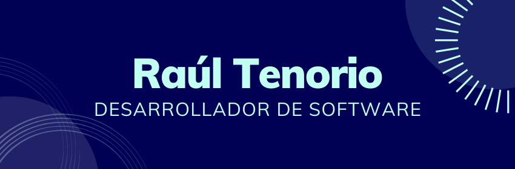

# Hola! Me llamo Raúl Tenorio 👋🧑‍💻

Soy un desarrollador de software ecuatoriano de 22 años! Me interesan los temas de innovación y mejoras tecnológicas, personalmente me gusta el aprendizaje continuo. Tengo experiencia en diseñar e implementar soluciones en base a requerimientos ya sean de tipo desarrollos para la web, aplicaciones móviles o de escritorio. 🔭 También he trabajado con gestión de calidad y soporte de proyectos, conozco el manejo de herramientas colaborativas de desarrollo como GitHub, GitLab y Sourcetree (Git en general), además las de planificación y modelado como Illustrator, Photoshop, Adobe Premiere, After Effects, Canva, Figma y Lucid Chart. Los lenguajes de programación que mayormente manejo es Python, Java, JavaScript, PHP, C y C++, como adicional conozco HTML y CSS junto la implementación de proyectos con React, ReactNative, Angular y Laravel. Los IDE's que usualmente uso son Visual Studio Code y NetBeans. Tengo la capacidad para armar la arquitectura completa de un sistema de base de datos con SQL. Finalmente, los sistemas operativos con los que convivo mi día a día son Windows y Linux de los cuales tengo un buen manejo de cada SO en cuestión de comandos. ⚡

# Encuéntrame alrededor de la web 🌎:
- 📜 Correo personal: tenorio0967@hotmail.com
- 📜 Correo de contacto: tenorio0967@gmail.com
- 🗨 Discord: radulh#9361

